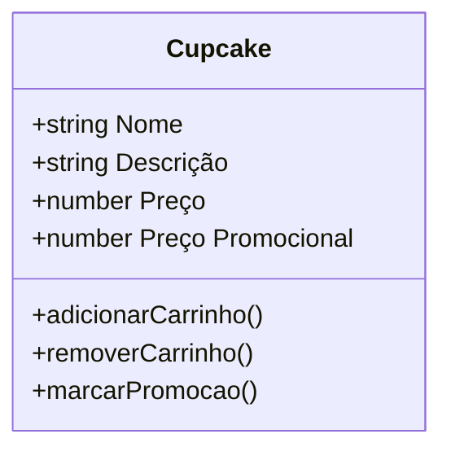

# 🧁 Açúcar e Canela - Projeto Integrador Transdisciplinar II

  
      

## 🎓 Dados da Instituição

**Instituição:** UNIFRAN - Universidade de Franca (Cruzeiro do Sul)  
**Curso:** Bacharelado em Engenharia de Software  
**Disciplina:** Projeto Integrador Transdisciplinar II  
**Aluno:** Igor Oliveira de Paula  
**RGM:** 29800871  
**Período:** 2025.2  
**Data de Entrega:** Novembro de 2025

***

## 📋 Escopo

Este projeto consiste no desenvolvimento de uma loja virtual de cupcakes utilizando WordPress como plataforma de gerenciamento de conteúdo (CMS) e WooCommerce como solução de e-commerce. O objetivo é aplicar conhecimentos transdisciplinares na criação de uma aplicação web completa, integrando conceitos de:

- Desenvolvimento web (front-end e back-end)
- Banco de dados relacional
- Design de interface e experiência do usuário
- Modelagem orientada a objetos
- Gestão de projetos de software

A aplicação permite aos clientes visualizar produtos, adicionar itens ao carrinho, aplicar cupons de desconto e finalizar compras de forma segura e intuitiva.

***

## 🛠️ Tecnologias Utilizadas

### Core
- **WordPress 6.8.2** - Sistema de gerenciamento de conteúdo
- **WooCommerce 10.1.2** - Plugin de e-commerce para WordPress
- **PHP 8.3.6** - Linguagem de programação server-side
- **MySQL 8.0.43** - Sistema de gerenciamento de banco de dados
- **Apache 2.4.58** - Servidor web HTTP

### Front-end
- **HTML5** - Estruturação de conteúdo
- **CSS3** - Estilização e layout responsivo
- **JavaScript ES6** - Interatividade e manipulação DOM

### Ambiente de Desenvolvimento
- **LAMP Stack** (Linux, Apache, MySQL, PHP) - Ambiente de desenvolvimento local
- **XAMPP** (Windows) - Solução completa para ambiente local
- **Git** - Controle de versão

### Plugins WordPress
- **WooCommerce** - Funcionalidades de e-commerce
- **Elementor** - Editor visual de páginas
- **All-in-One WP Migration** - Backup e migração de sites

***

## 🚀 Como Usar

### Pré-requisitos

**Linux:**
- Apache 2.4+
- PHP 8.3+
- MySQL 8.0+
- Extensões PHP: mysqli, curl, gd, mbstring, xml

**Windows:**
- XAMPP 8.0+ (inclui Apache, MySQL e PHP)
- Git (para clonar o repositório)

---

### Instalação no Linux

#### 1. Clone o repositório
```bash
git clone https://github.com/seu-usuario/projeto-integrador-cupcakes.git
cd projeto-integrador-cupcakes
```

#### 2. Configure o Apache
Copie os arquivos para o diretório do servidor:
```bash
sudo cp -r * /var/www/html/cupcakes/
sudo chown -R www-data:www-data /var/www/html/cupcakes/
sudo chmod -R 755 /var/www/html/cupcakes/
```

#### 3. Configure o banco de dados
Acesse o MySQL:
```bash
mysql -u root -p
```

Crie o banco e importe os dados:
```sql
CREATE DATABASE cupcakes_db CHARACTER SET utf8mb4 COLLATE utf8mb4_unicode_ci;
CREATE USER 'cupcakes_user'@'localhost' IDENTIFIED BY 'sua_senha_segura';
GRANT ALL PRIVILEGES ON cupcakes_db.* TO 'cupcakes_user'@'localhost';
FLUSH PRIVILEGES;
EXIT;
```

Importe o arquivo SQL:
```bash
mysql -u root -p cupcakes_db < database.sql
```

#### 4. Configure o WordPress
Copie e edite o arquivo de configuração:
```bash
cp wp-config-sample.php wp-config.php
nano wp-config.php
```

Edite as seguintes linhas:
```php
define( 'DB_NAME', 'cupcakes_db' );
define( 'DB_USER', 'cupcakes_user' );
define( 'DB_PASSWORD', 'sua_senha_segura' );
define( 'DB_HOST', 'localhost' );
```

Gere novas chaves de segurança em: https://api.wordpress.org/secret-key/1.1/salt/

#### 5. Reinicie o Apache
```bash
sudo systemctl restart apache2
```

#### 6. Acesse o site
Abra o navegador e acesse: `http://localhost/cupcakes`

**Credenciais de acesso admin:**
- Usuário: `admin`
- Senha: `wpadmin123` (ALTERE IMEDIATAMENTE após primeiro login)

---

### Instalação no Windows (XAMPP)

#### 1. Instale o XAMPP
- Baixe o XAMPP em: https://www.apachefriends.org/
- Execute o instalador e instale Apache, MySQL e PHP
- Inicie o **Apache** e **MySQL** pelo painel de controle do XAMPP

#### 2. Clone o repositório
Abra o terminal (CMD ou PowerShell):
```bash
cd C:\xampp\htdocs
git clone https://github.com/seu-usuario/projeto-integrador-cupcakes.git
cd projeto-integrador-cupcakes
```

Ou baixe o ZIP do repositório e extraia em `C:\xampp\htdocs\cupcakes\`

#### 3. Configure o banco de dados
- Acesse o phpMyAdmin: http://localhost/phpmyadmin
- Clique em **Novo** para criar um banco de dados
- Nome do banco: `cupcakes_db`
- Collation: `utf8mb4_unicode_ci`
- Clique em **Importar** e selecione o arquivo `database.sql`

#### 4. Configure o WordPress
- Copie o arquivo `wp-config-sample.php` e renomeie para `wp-config.php`
- Abra com um editor de texto (Notepad++, VS Code, etc)
- Edite as seguintes linhas:

```php
define( 'DB_NAME', 'cupcakes_db' );
define( 'DB_USER', 'root' );
define( 'DB_PASSWORD', '' );  // Deixe vazio se não configurou senha no XAMPP
define( 'DB_HOST', 'localhost' );
```

- Acesse https://api.wordpress.org/secret-key/1.1/salt/
- Copie as chaves geradas e substitua no `wp-config.php`

#### 5. Ajuste de permissões (opcional)
No Windows, geralmente não é necessário ajustar permissões, mas caso tenha problemas:
- Clique com botão direito na pasta `cupcakes`
- Propriedades → Segurança → Editar
- Dê permissões de leitura/escrita para o usuário atual

#### 6. Acesse o site
Abra o navegador e acesse: `http://localhost/cupcakes`

**Credenciais de acesso admin:**
- Usuário: `admin`
- Senha: `wpadmin123` (ALTERE IMEDIATAMENTE após primeiro login)

***

## ✨ Principais Funcionalidades

### Para Clientes
- ✅ Catálogo de produtos com imagens e descrições detalhadas
- ✅ Sistema de carrinho de compras
- ✅ Aplicação de cupons de desconto
- ✅ Criação de conta de usuário
- ✅ Histórico de pedidos
- ✅ Interface responsiva (desktop, tablet e mobile)

### Para Administradores
- ✅ Painel administrativo do WordPress
- ✅ Gerenciamento de produtos (adicionar, editar, excluir)
- ✅ Controle de estoque
- ✅ Gestão de pedidos e status de entrega
- ✅ Configuração de métodos de pagamento
- ✅ Configuração de opções de frete
- ✅ Relatórios de vendas e analytics
- ✅ Gerenciamento de cupons promocionais
- ✅ Gestão de categorias de produtos

***

## 📝 Requisitos

### Requisitos Funcionais

| ID | Descrição |
|----|-----------|
| **RF01** | O sistema deve exibir catálogo de produtos com nome, descrição, imagem e preço |
| **RF02** | O sistema deve permitir adicionar produtos ao carrinho de compras |
| **RF03** | O sistema deve permitir visualizar, modificar quantidades e remover itens do carrinho |
| **RF04** | O sistema deve calcular automaticamente o valor total do pedido |
| **RF05** | O sistema deve permitir aplicar cupons de desconto |
| **RF06** | O sistema deve exibir produtos com preço promocional destacado |
| **RF07** | O sistema deve processar checkout com dados de entrega e pagamento |
| **RF08** | O sistema deve permitir criação de conta de usuário |
| **RF09** | O sistema deve enviar confirmação de pedido por e-mail |
| **RF10** | Administradores devem gerenciar produtos, pedidos e configurações |

### Requisitos Não Funcionais

| ID | Descrição |
|----|-----------|
| **RNF01** | As páginas devem carregar em menos de 3 segundos |
| **RNF02** | A interface deve ser responsiva e funcionar em dispositivos móveis |
| **RNF03** | O sistema deve ser compatível com navegadores modernos (Chrome, Firefox, Edge, Safari) |
| **RNF04** | O sistema deve manter dados seguros com criptografia HTTPS |
| **RNF05** | Senhas devem ser armazenadas com hash seguro |
| **RNF06** | O sistema deve suportar pelo menos 100 acessos simultâneos |
| **RNF07** | A interface deve seguir princípios de usabilidade e acessibilidade |

***

## 📊 Modelagem de Dados

A modelagem do sistema foi estruturada com base em orientação a objetos, tendo como entidade principal a classe Cupcake. Confira abaixo a representação utilizando mermaid.

### Diagrama de Classes



***

## 🔗 Links Úteis

- 🌐 **Site em Produção:** [Clique Aqui](https://sintari.com.br/)
- 📄 **Relatório Completo:** [Clique Aqui](https://igorpaula7.notion.site/PIT-II-ECommerce-WP-Cupcakes-28da1c1c46f98007a885ff7b89e9a151?pvs=74)
- 🎥 **Vídeo de Apresentação:** EM ANDAMENTO.
- 📚 **Documentação WordPress:** https://wordpress.org/documentation/
- 🛒 **Documentação WooCommerce:** https://woocommerce.com/documentation/

***

## 📞 Suporte

**Desenvolvedor:** Igor Oliveira de Paula
**E-mail:** igoroliveira7896@gmail.com
**LinkedIn:** [Clique Aqui](https://www.linkedin.com/in/igorpaula7/)
**GitHub:** igorpaula7

Para problemas, dúvidas ou sugestões, abra uma **Issue** neste repositório.

***

## 📄 Licença

Este é um projeto acadêmico desenvolvido para fins educacionais como parte do Projeto Integrador Transdisciplinar e tem suas diretrizes de licença de acordo com o Apache 2.

***
